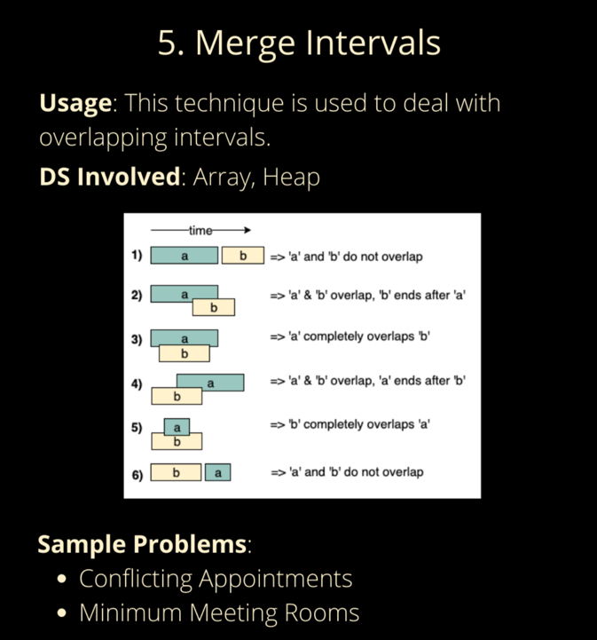
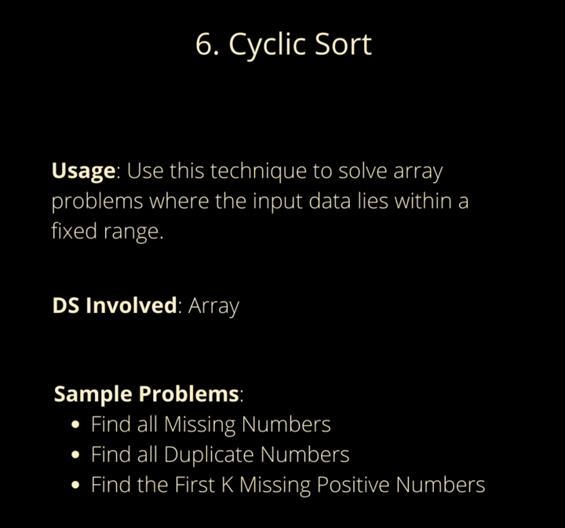
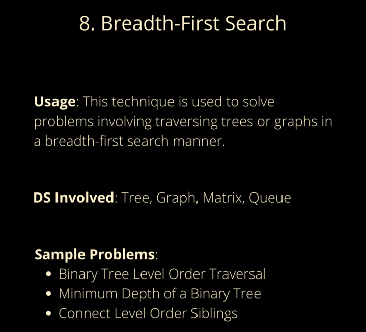
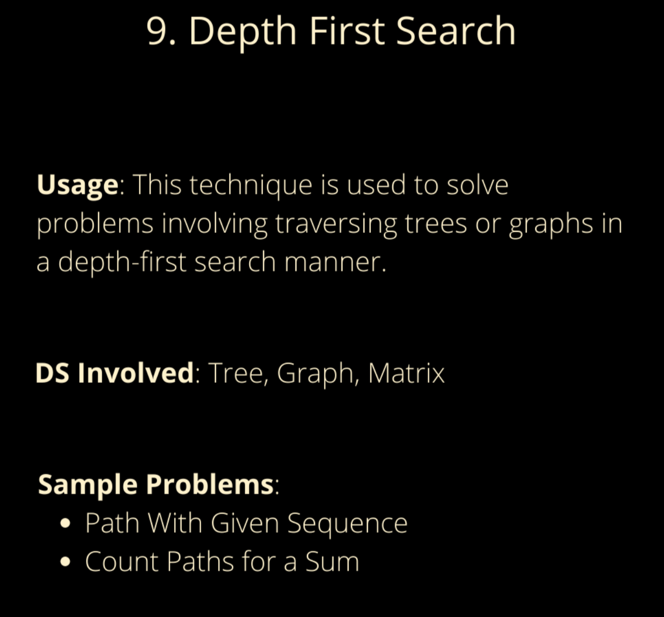
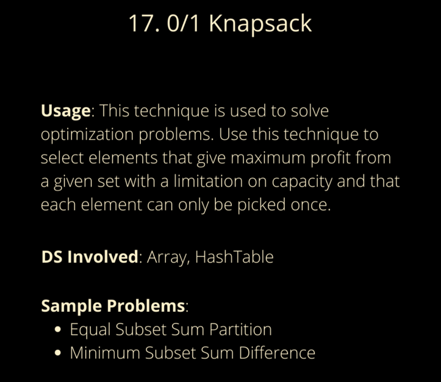

# 20 js patterns

* https://levelup.gitconnected.com/dont-just-leetcode-follow-the-coding-patterns-instead-4beb6a197fdb *

Merge Intervals
Cyclic Sort
Sliding Window
Islands (Matrix Traversal)
Two Pointers
Fast & Slow Pointers
In-place Reversal of a LinkedList
Tree Breadth-First Search
Tree Depth First Search
Two Heaps
Subsets
Modified Binary Search
Bitwise XOR
Top ‘K’ Elements
K-way Merge
Topological Sort
0/1 Knapsack
Fibonacci Numbers
Palindromic Subsequence
Longest Common Substring

